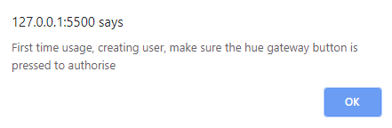
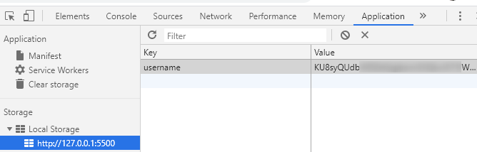
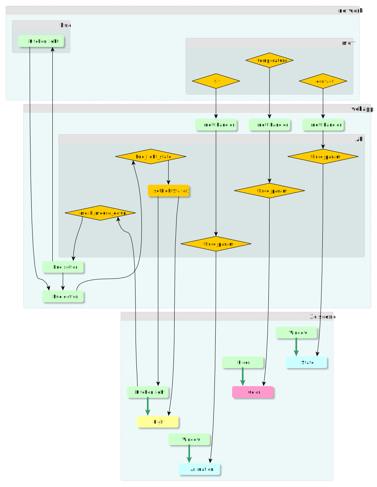
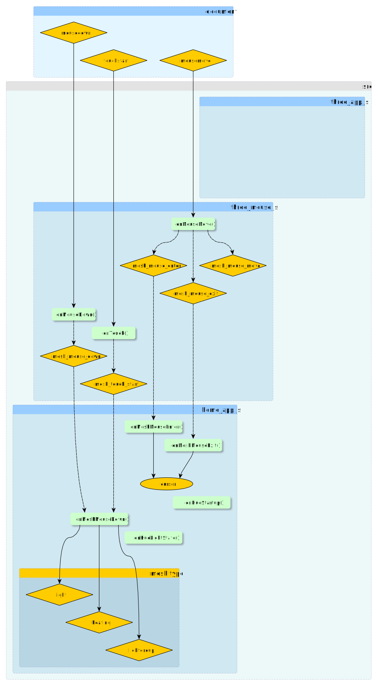

# hue lights integration

<table>
<tr>
<td>Link to Github .io live demo (see HowTo / Usage)</td>
<td><a href="https://homesmartmesh.github.io/smart_home_3d_webapp/">smart home 3d webapp</a></td>
</tr>
</table>
 

We see in this demo a home 3d model augmented with interactive mesh items. Some meshes represent light bulbs and generate events when the user clicks on them. Those events are handled by a hue light client that interacts with the real hue gateway. The hue client publishes as events the actual state of the switched light, and that state is updated by the mesh bulb color and the associated 3d light.

As a demonstration for the reaction time of the real light switching on and off, we can see in the gif animation the power consumption log of the light switched. This log comes from a [shelly 2.5 device](https://shelly.cloud/shelly-25-wifi-smart-relay-roller-shutter-home-automation/) with power monitoring capabilites. This measure device is itself powering up the hue light. Note that the slow power up and down ramp are due to the hue effect of slow variation when switching on and off.

# How to

## Create your own home model

The created home model should have custom properties. It is also possible to use the existing home model file and edit it as it is a json format : `./3d_models/home.gltf`. It is possible to rename the `hue: ` field with your own hue lights names as known by the hue gateway.

Example below :

    "extras" : {
        "mouseEvent" : "true",
        "type" : "light",
        "hue" : "Bathroom main"

## Usage
* preffered and recommended way : host this repo on your own local rapsberry pi webserver. A vpn is recommended as a solution to remotely get into your local netwrok. Any sort of port exposing and https secure hosting will require a complete security check and would be run with an unknown risk.

* non preferred way : but can be used for test and demonstration purpose, directly from github.io : https://homesmartmesh.github.io/smart_home_3d_webapp/

Limitation when using from github .io :
 - Github .io are the exact deployment of this same repo, the master branch is deployed so is not stable and might not run as it did the last time you used it.
 - Network safety : As the hue.js script is using http, a mixed content http/https error will happen when using from github .io as it is an https server. It is still possible to override this safety.
 - It is not possible to customize your own 3d model
 - It is not possible to update the name of your hue lights (you could still rename some to match the `./3d_models/home.gltf` content)

<a style="color:red">So proceed with this only if you know what you're doing. This might expose you at risk if done through an untrusted website :</a>

 
 

then reload the page

## First time usage

1. create your own glTF model from blender (or use existing one)
2. adjust the light names to match your hue lights names
3. press the Hue Gateway authorisation button
4. Load or reload the web app page
5. An alert will apear on the screen to wait for confirmation

6. The user creation will proceed and the username will be stored as local storage (ctrl+j in chrome to oben the debug window)

7. The webapp can be now used in sync with the hue Gateway interactions. In case a Gateway sync is not needed, it is possible to click "Ok" on the later and proceed with a non synced app.

# Dependencies

* [three.js](https://threejs.org/)
* [jsHue.js](https://github.com/blargoner/jshue)
* [mqttws31](https://cdnjs.cloudflare.com/ajax/libs/paho-mqtt/1.0.1/mqttws31.min.js)
* [web_three_interface](https://github.com/HomeSmartMesh/web_three_interface)

## Features
* glTF model with custom properties including interactive meshes and hue light names
* Hue query on startup to set correct light states, on/off and reachability
* Consistent state on startup and on actions with the real light bulbs (but no polling in between)

## web_three_interface
The [web_three_interface](https://github.com/HomeSmartMesh/web_three_interface) is not a direct dependency but is used as a boiler plate for 3d interactive meshes. It is still a useful repo that helps understand the workflow step by step with increasingly complex demo, and also debug in case one step is failing.

# Interaction models with glTF custom properties
The currently provided 3d interaction types are :
* Light
* Lightgroup
* State : Mesh States
* Animted : glTF Mesh Animation
* Color : Properties Color Animation

## Events propagation model and API

## Mouse events propagation

