# Discourse forum
get support, give feedback or simply chat to brainstorm about ideas on the forum

[](https://homesmartmesh.discourse.group/c/webapps/14)

[smart-home-3d ( https://homesmartmesh.discourse.group/c/webapps/14 )](https://homesmartmesh.discourse.group/c/webapps/14)


# Website documentation
[Home 3D doc](https://www.homesmartmesh.com/docs/applications/home3d/)
* documentation with interactive embeds

# First time usage
1. host this project on your local raspberry pi or see ['Local host vs Remote host' section](#Local-host-vs-remote-host) on how to use the live demo
2. create your own glTF model from blender (optional)

## activate hue bridge connection
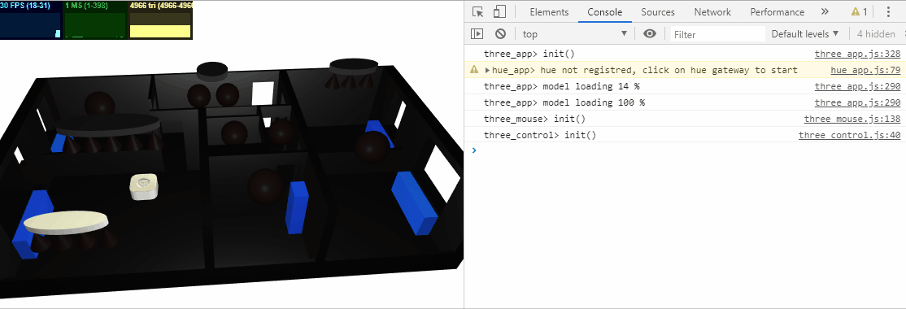

1. adjust the light names to match your hue lights names
2. press the Hue Gateway authorisation button (on the real device)
3. Click on the 3d model of the hue gateway
4. An alert will apear on the screen to wait for confirmation
5. The user creation will proceed and the username will be stored as local storage (ctrl+j in chrome to oben the debug window)


## activate mqtt connection
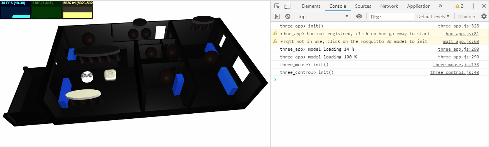

1. adjust the mqtt topic names to match your mqtt devices
2. install a mosquitto version with websocket support
3. Click on the 3d model of the mosquitto gateway

## Live demo
Link to [Github .io live demo](https://homesmartmesh.github.io/smart_home_3d_webapp/)

## Demo light control with power log

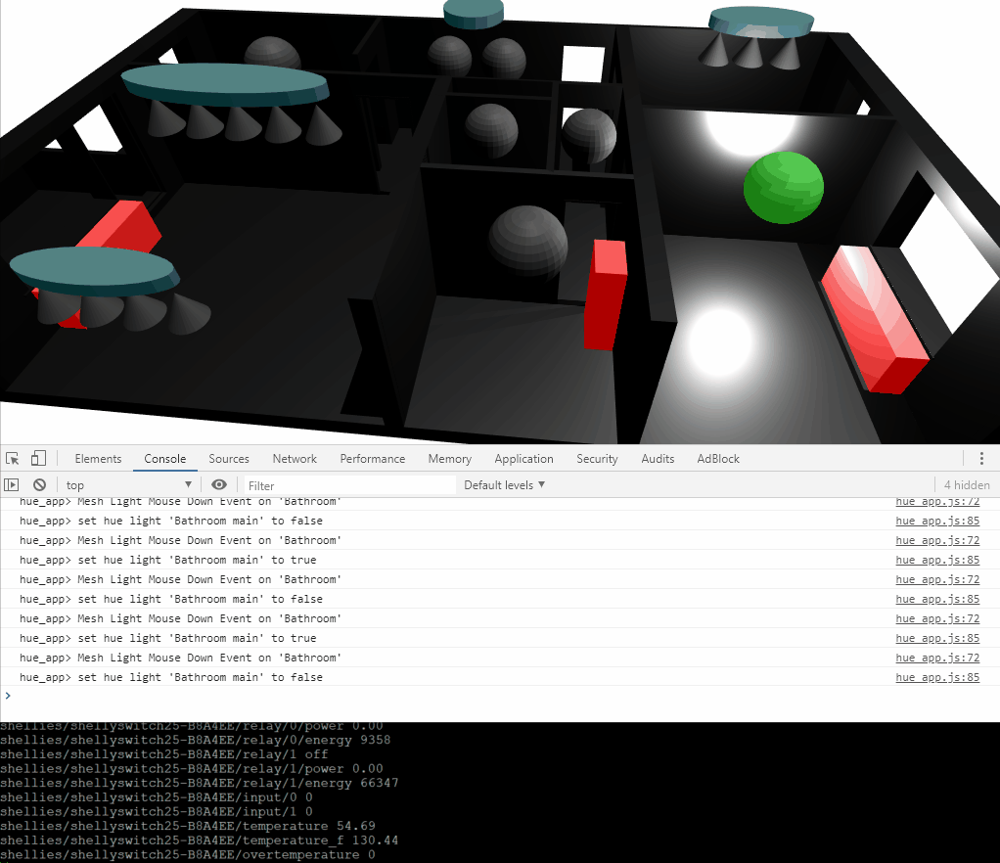

We see in this demo a home 3d model augmented with interactive mesh items. Some meshes represent light bulbs and generate events when the user clicks on them. Those events are handled by a hue light client that interacts with the real hue gateway. The hue client publishes as events the actual state of the switched light, and that state is updated by the mesh bulb color and the associated 3d light.

As a demonstration for the reaction time of the real light switching on and off, we can see in the gif animation the power consumption log of the light switched. This log comes from a [shelly 2.5 device](https://shelly.cloud/shelly-25-wifi-smart-relay-roller-shutter-home-automation/) with power monitoring capabilites. This measure device is itself powering up the hue light. Note that the slow power up and down ramp are due to the hue effect of slow variation when switching on and off.

# Concept
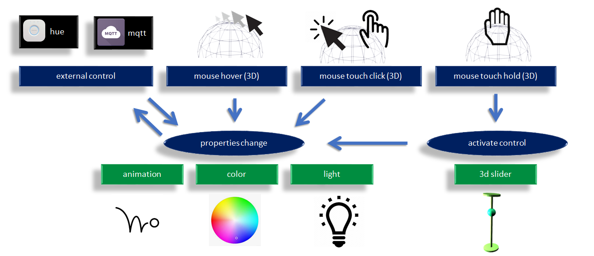

Home automation connected to 3d events in javascript

```javascript
send_custom_event("three_param",{name:"Kitchen", color:0.3});
send_custom_event("three_param",{name:"Kitchen", light:0.3});
send_custom_event("three_param",{name:"Kitchen", anim:0.3});
send_custom_event("three_param",{name:"Kitchen", pull:0.3});
send_custom_event("three_param",{name:"Kitchen", push:0.3});
```


See `three_param` running in a [live demo](https://homesmartmesh.github.io/web_three_interface/12_multiple_parameters/)

# Hue lights usage
Note : This project is not related to the hue devices supplier and is a simple user of the provided API.
## Hue features
* All individual lights and lightgroups visible and usable on the same view (not possible with other hue apps)
* Correct display of light status. On off and grayed when not reachable (other apps might show out of reach lights same color as the ones switched on)
* Click/Touch light to control on-off
* Cilck/Touch lightgroup to control on / off (using any_on)
* hold and use 3d slider to adjust the light brightness (lights and groups)
* hold and control allows to dim light up gradually out of zero without a bang in case of previous dim state was high, and it is possible to jump to previous dim state by switch on with touch or click (other apps dissociate switch on and dimming functions, so that if left at high dim level, you have to switch it on on full brightness first before being able to dim it lower)
* 3d light bulbs and 3d light brightness vary in sync when controlling the 3d slider (groups slider on exit only)
* webapp lights kept in sync even when used externally. Configurable polling is used (default is 2 sec), event `hue_all_lights` only sent on changes (shallow compare)


## Hue config in blender
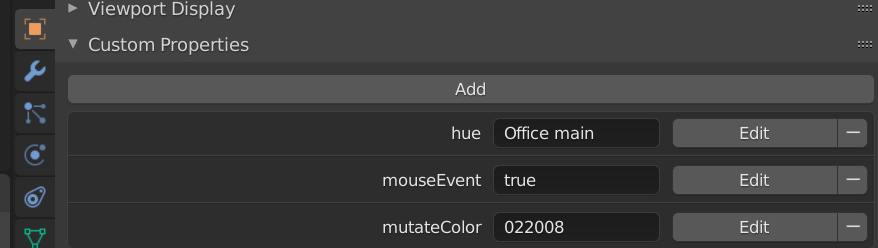

configuration of hue light name in blender Light bulb object Custom properties.

## Hue events application code

```javascript
window.addEventListener( 'hue_lights_on_startup', onHueStartup, false );
window.addEventListener( 'hue_light_state', onHueLightState, false );

function onHueLightState(e){
    const name = hue_mesh_name[e.detail.name];
    send_custom_event("three_param",{name:name, light:e.detail.on});
}
```

lights broadcast their state on startup and as a feedback when updated from javascript

## Hue light groups
* Lightgroup are optional and the individual light items configuration does not differ depending on if they are part of a light group or not.
* only the hue gateway lightgroup is being used. That means a lightgroup has to be created with the hue app before it can be used in this webapp.

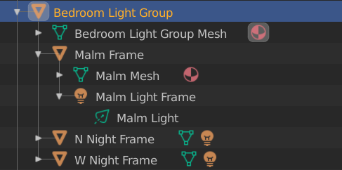

Indiviual lights have to be attached to a parent mesh that have these custom properties

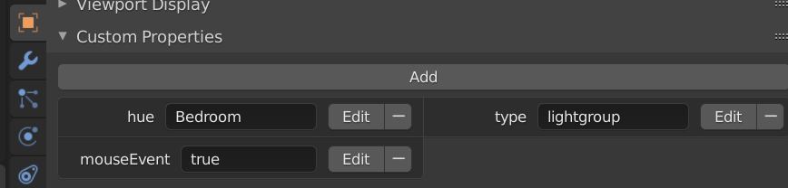

* a lightgroup shall also have a `hue` field, the only differerence is that it has no blender light item and does have a `type:lightgroup` property.
* as the hue gateway allow it, a normal light and a lightgroup can have the same name.

## tested hue light types

* productname: Hue color spot
  * modelid: LCG002
  * type: Extended color light
  * config:{archetype:wallspot}
  * state:{on, bri, hue, sat, effect, xy, ct}
  * capabilities:{control:{mindimlevel, maxlumen, ct:{min,max}, colorgamuttype, colorgamut:[0,1,2]}}
* productname: Hue ambiance spot
  * modelid: LTW013
  * type: Color temperature light
  * config:{archetype:singlespot}
  * state:{color,bri,ct}
  * capabilities:{control:{mindimlevel, maxlumen, ct:{min,max}}}
* productname: "Hue white lamp"
  * modelid: LWB010
  * type: Dimmable light
  * config:{archetype:classicbulb}
  * state:{on, bri}
  * capabilities:{control:{mindimlevel, maxlumen}}
* productname: Hue filament bulb
  * modelid: LWO001
  * type: Dimmable light
  * config:{archetype:vintagebulb}
  * state:{on, bri}
  * capabilities:{control:{mindimlevel, maxlumen}}
* productname: Color temperature light
  * modelid: RS 128 T
  * type: Color temperature light
  * config:{archetype:wallspot}
  * state:{on, bri, ct}
  * capabilities:{control:{ct:{min,max}}}
* productname: Color temperature light
  * modelid: RB 148 T
  * type: Color temperature light
  * config:{archetype:candlebulb}
  * state:{on, bri, ct}
  * capabilities:{control:{ct:{min,max}}}

ct unit is Mired M = 1000000/T; [Mired](https://en.wikipedia.org/wiki/Mired)

## demo light groups
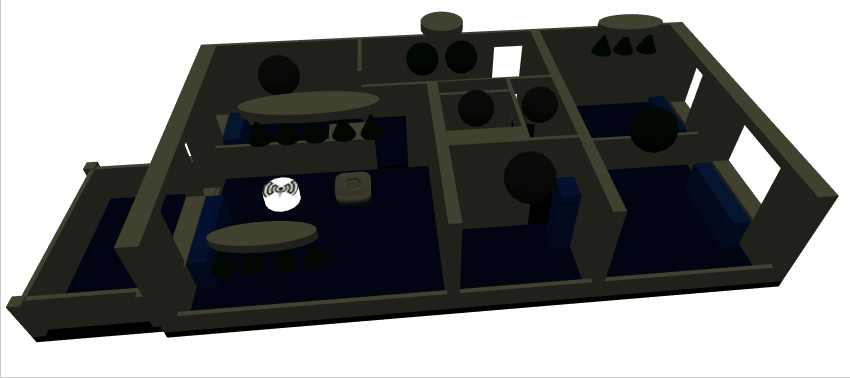

## demo light and group dimming
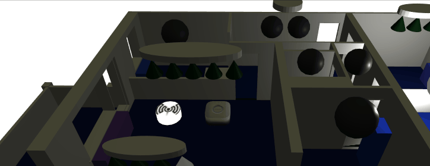

## Mqtt config in blender

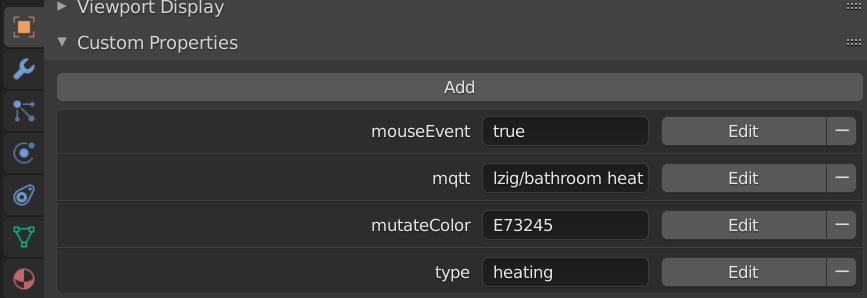

The mqtt topic has to be assigned to an `mqtt` custom property

## Mqtt events application code

```javascript
window.addEventListener( 'mqtt_message', onMqttMessage, false);

function onMqttMessage(e){
    ...
	if(obj.userData.type == "heating"){
		const heating_demand = e.detail.payload.pi_heating_demand;
		send_custom_event('three_param',{name:obj_name,color:heating_demand});
	}
}
```
## Mqtt temperature sensors on room floor color

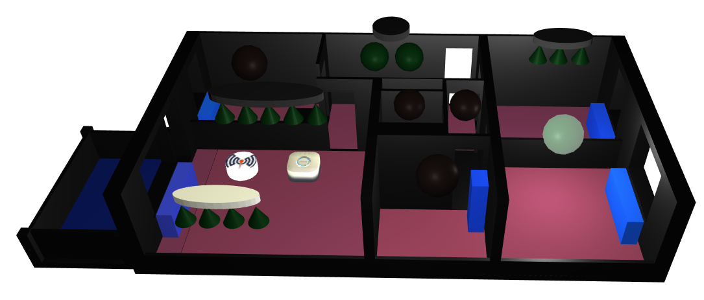


# blender home model

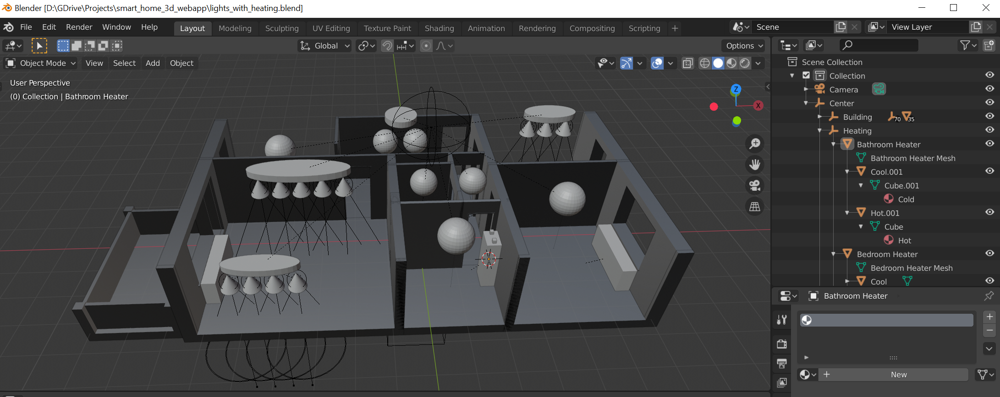

[blender file download from google drive](https://drive.google.com/drive/folders/1DFyGKp_6VMN4Vp36PCXglEsV0zEX9iyz?usp=sharing)

The blender model export in .glTF is already part of this repo. So you would only need the blender file in case you'd like a template to start with and customise.

Files within the [project's google drive folder](https://drive.google.com/drive/folders/1DFyGKp_6VMN4Vp36PCXglEsV0zEX9iyz?usp=sharing) will have commit ids to match them with this repo.

The created home model should have custom properties. It is also possible to use the repo's home model file and edit it as it is a json format : `./3d_models/home.gltf`. It is possible to rename the `hue: ` field with your own hue lights names as known by the hue gateway.

```json
    "extras" : {
        "mouseEvent" : "true",
        "type" : "light",
        "hue" : "Bathroom main"
```

# Requirements

* mqtt usage require a mosquitto with websocket support, see this guide on how to [install mosquitto with websockets](https://gist.github.com/smoofit/dafa493aec8d41ea057370dbfde3f3fc)

# Dependencies

* [three.js](https://threejs.org/)
* [jsHue.js](https://github.com/blargoner/jshue)
* [mqttws31](https://cdnjs.cloudflare.com/ajax/libs/paho-mqtt/1.0.1/mqttws31.min.js)
* [web_three_interface](https://github.com/HomeSmartMesh/web_three_interface)

## web_three_interface
The [web_three_interface](https://github.com/HomeSmartMesh/web_three_interface) is not a direct dependency but is used as a boiler plate for 3d interactive meshes. It is still a useful repo that helps understand the workflow step by step with increasingly complex demo, and also debug in case one step is failing.


# Features
* 3d interactions with click and hold
* 3d slider positioning relative to child world coordinate
* glTF model with custom properties (hue, mqtt, mouse)
* mqtt: events forward to javascript events
* stats and fps. (can be disabled in [config.json](./config.js))
* heaters pi_heating_demand on heater mesh colors
* rooms temperature on floor color
* EffectComposer and outlinePass for app selected interactive objects (`three_param:outline`)

## Planned Features

* enhance 3d slider with more info about limits and states
* adjust heating with 3d slider
* hue light dimming : required visible difference between minimal dimm and off
* directional light to reflect room sensors ambient light
* add windows open close with colors
* use lower poly mesh
* add coap support through node server (split, back+front) but keep the same front
* add android native app with sockets and coap permissions
* add fallback support with a websocket/socket wrapper https://github.com/novnc/websockify

* fall back on interactive demo mode from within the same app
* meta light groups with parenting
* add direct mqtt support wtihout websockets through node server

## issues and limitations
* no material animation supported by gltf, so fallback on a mutateColor custom property
* No Custom Properties export for Light Object Data Properties (green), only Object Properties (orange)
* gltf-blender : No area light export possible [github issue](https://github.com/KhronosGroup/glTF-Blender-IO/issues/786)
* three.js : RectAreaLight [has limitations and conditions](https://threejs.org/docs/#api/en/lights/RectAreaLight) [RectAreaLight demo](https://threejs.org/examples/webgl_lights_rectarealight.html)


## Local host vs remote host
* preffered and recommended way : host this repo on your own local rapsberry pi webserver. A vpn is recommended as a solution to remotely get into your local netwrok. Any sort of port exposing and https secure hosting will require a complete security check and would be run with an unknown risk.

* non preferred way : but can be used for test and demonstration purpose, directly from github.io : https://homesmartmesh.github.io/smart_home_3d_webapp/

Limitation when using from github .io :
 - Github .io are the exact deployment of this same repo, the master branch is deployed so is not stable and might not run as it did the last time you used it.
 - Network safety : As the hue.js script is using http, a mixed content http/https error will happen when using from github .io as it is an https server. It is still possible to override this safety.
 - It is not possible to customize your own 3d model
 - It is not possible to update the name of your hue lights (you could still rename some to match the `./3d_models/home.gltf` content)

<a style="color:red">So proceed with this only if you know what you're doing. This might expose you at risk if done through an untrusted website :</a>


<br>
<br>


then reload the page

# Performance
[webgl report website](https://webglreport.com/)

test model : 8000 triangls

* PC wtih NVIDIA GeForce GTX 745 : 30 FPS, 5 ms
* Samsung galaxy S10 : 60 FPS
* Samsung galaxy S5 : 14 FPS
* Samsung galaxy Tab pro (SM-P900) :  N.A (does not fully load, simplified scene with 3000 tri at 2 FPS)
